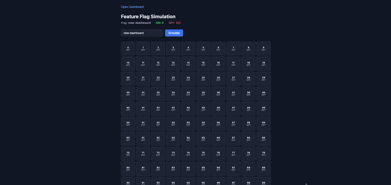
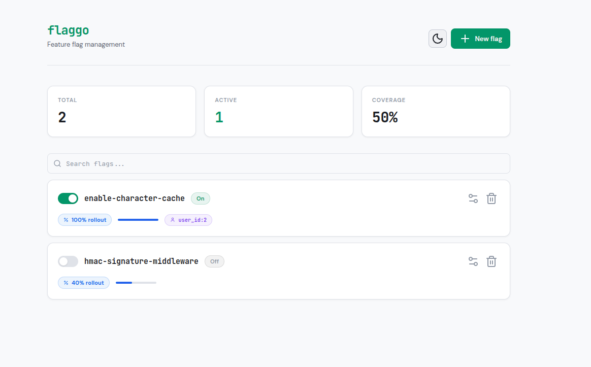

# Flaggo


A framework-agnostic feature flag library for Go. Supports file-based and Redis-based storage, actor targeting, percentage rollouts, and an optional web dashboard.



## Features

- Framework-agnostic — works with `net/http`, Fiber, Chi, Echo, or any Go HTTP framework
- Actor-based targeting (e.g. enable a flag for specific users or regions)
- Percentage rollouts with deterministic hashing
- Pluggable storage: JSON file or Redis
- Optional web dashboard with light/dark theme and search
- Optional HTTP Basic Authentication
- Thread-safe and production-ready

## Installation

```sh
go get github.com/miqdadyyy/flaggo
```

## Quick Start

### File-based Provider

```go
package main

import (
	"log"
	"net/http"

	"github.com/miqdadyyy/flaggo"
	"github.com/miqdadyyy/flaggo/providers/fileprovider"
	"github.com/miqdadyyy/flaggo/web"
)

func main() {
	fp, err := fileprovider.New(fileprovider.Options{
		Path: "storage/flags.json",
	})
	if err != nil {
		log.Fatal(err)
	}

	ff := flaggo.New(fp)

	http.Handle("/flags", web.Handler(ff))
	log.Fatal(http.ListenAndServe(":3000", nil))
}
```

### Redis-based Provider

```go
package main

import (
	"log"
	"net/http"

	"github.com/miqdadyyy/flaggo"
	"github.com/miqdadyyy/flaggo/providers/redisprovider"
	"github.com/miqdadyyy/flaggo/web"
)

func main() {
	rp, err := redisprovider.New(redisprovider.Options{
		Addr:   "redis://localhost:6379/0",
		Prefix: "flaggo:",
	})
	if err != nil {
		log.Fatal(err)
	}

	ff := flaggo.New(rp)

	http.Handle("/flags", web.Handler(ff))
	log.Fatal(http.ListenAndServe(":3000", nil))
}
```

## Programmatic Usage

```go
ctx := context.Background()

// Check if a flag is enabled
if ff.IsEnabled(ctx, "new-checkout") {
	// new checkout flow
}

// Enable / disable / toggle
ff.Enable(ctx, "new-checkout")
ff.Disable(ctx, "new-checkout")
ff.Toggle(ctx, "new-checkout")

// Set full configuration
ff.SetConfig(ctx, "new-checkout", flaggo.FlagConfig{
	Enabled: true,
	Rollout: 50, // 50% of sessions
	Actors: map[string][]string{
		"user_id": {"alice", "bob"},
	},
})

// Pre-populate flags (new keys created as disabled, existing ones left unchanged)
ff.Populate(ctx, []string{"feature-a", "feature-b"})
```

## Actor Targeting

Attach an actor to the context to enable per-user or per-attribute targeting:

```go
actor := flaggo.Actor{
	Attributes: map[string]string{
		"user_id":    "alice",
		"country":    "US",
		"session_id": "abc123",
	},
}

ctx := flaggo.WithActor(context.Background(), actor)

// Flag evaluation now considers actor attributes and rollout percentage
if ff.IsEnabled(ctx, "premium-feature") {
	// enabled for this actor
}
```

Evaluation order:
1. If the flag does not exist or is disabled → `false`
2. If the actor matches any entry in the flag's actor list → `true`
3. If `hash(flagKey + session_id) % 100 < rollout` → `true`
4. Otherwise → `false`

## Authentication

Protect the dashboard and API with HTTP Basic Authentication:

```go
ff := flaggo.New(provider, flaggo.Config{
	Username: "admin",
	Password: "secret",
})
```

## API Endpoints

The JSON API is available when requests include `Accept: application/json`.

| Method | Query        | Description              | Body                                                                        |
|--------|--------------|--------------------------|-----------------------------------------------------------------------------|
| GET    |              | List all flags           | —                                                                           |
| GET    | `?key=name`  | Get a specific flag      | —                                                                           |
| POST   |              | Create or update a flag  | `{"key": "name", "enabled": true, "actors": {"user_id": ["alice"]}, "rollout": 50}` |
| DELETE |              | Disable a flag           | `{"key": "name"}`                                                           |
| PATCH  |              | Toggle a flag            | `{"key": "name"}`                                                           |

## Web Dashboard


Visit the handler path in your browser for a management UI with:
- Create, toggle, and configure flags
- Actor targeting and rollout percentage controls
- Search/filter flags
- Light and dark theme (follows system preference)

## Custom Provider

Implement the `Provider` interface to use your own storage backend:

```go
type Provider interface {
	Set(ctx context.Context, key string, config FlagConfig) error
	Get(ctx context.Context, key string) (FlagConfig, bool)
	All(ctx context.Context) (map[string]FlagConfig, error)
}
```
